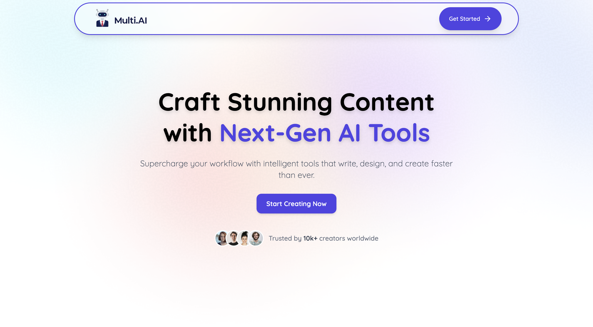
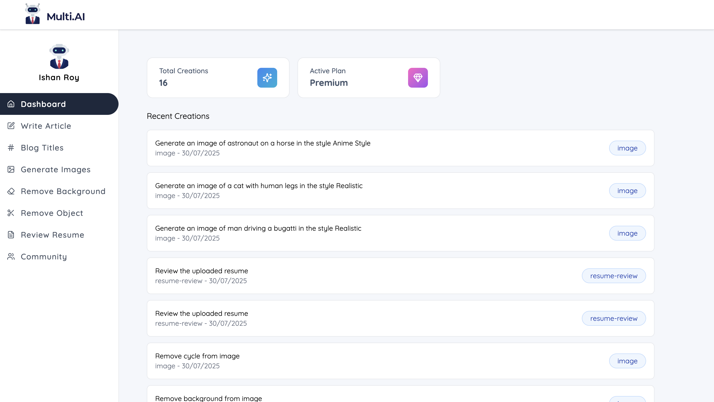
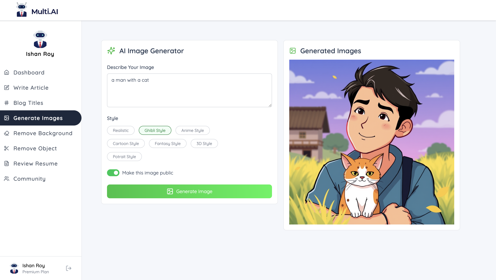

# Multi.AI 🚀

Craft stunning content with **Next-Gen AI Tools**!
**Multi.AI** is a web platform that allows you to **generate images, remove backgrounds or objects, write articles, and review resumes**—all powered by AI.

🔗 **Live Demo:** [Multi.AI](https://pern-multiai-client.vercel.app/)
📂 **Repository:** [pern-multiai](https://github.com/RADXIshan/pern-multiai)

---

## ✨ Features

* 🎨 **AI Image Generation** – Create images in Realistic, Anime, Ghibli, Cartoon, Fantasy, and 3D styles.
* 🖼 **Background & Object Removal** – Quickly remove unwanted elements from photos.
* ✍️ **Content Creation** – Generate blog titles, articles, and creative text.
* 📄 **Resume Review** – Get instant AI-powered feedback on your resumes.
* 📊 **User Dashboard** – Track and manage your AI creations with ease.

---

## 📸 Screenshots

| Landing Page                | Dashboard                     | AI Tool                   |
| --------------------------- | ----------------------------- | ------------------------- |
|  |  |  |

---

## 🛠 Tech Stack

* **Frontend:** React.js, Tailwind CSS
* **Backend:** Node.js, Express.js
* **Database:** PostgreSQL
* **Authentication:** Clerk
* **AI Tools:** Google Gemini AI, ClipDrop AI
* **Hosting:** Vercel (Frontend), Backend configurable

---

## 🚀 Getting Started

Follow these steps to set up **Multi.AI** locally:

```bash
# 1️⃣ Clone the repository
git clone https://github.com/RADXIshan/pern-multiai.git

# 2️⃣ Navigate into the project folder
cd pern-multiai

# 3️⃣ Install dependencies
npm install

# 4️⃣ Start the development server
npm run dev
```

---

## ⚙️ Environment Variables

Create a `.env` file in the **backend** and **frontend** with the following values:

### **Backend `.env`**

```bash
DATABASE_URL=your_database_url
CLERK_PUBLISHABLE_KEY=your_clerk_api_key
CLERK_SECRET_KEY=your_clerk_secret_key
GEMINI_API_KEY=your_geminiai_api_key
CLIPDROP_API_KEY=your_clipdrop_api_key
CLOUDINARY_CLOUD_NAME=your_cloud_name
CLOUDINARY_API_KEY=your_cloud_api_key
CLOUDINARY_API_SECRET=your_cloud_api_secret
PORT=your_localhost_port
```

### **Frontend `.env`**

```bash
VITE_CLERK_PUBLISHABLE_KEY=your_clerk_api_key
VITE_BASE_URL=your_backend_url
```

---
